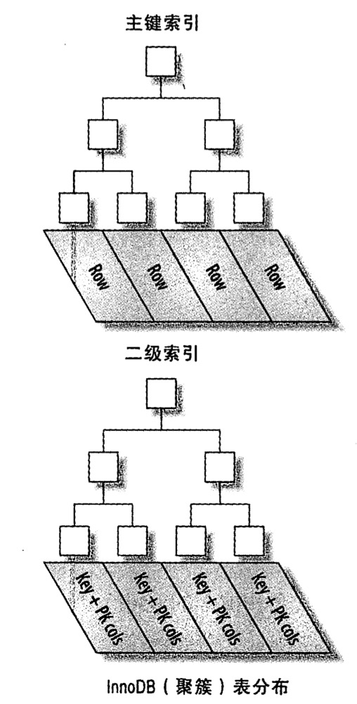

* 在建表的时候，有时候会遇到下面说的情况，一样东西可以存在于多个平台，用1，2，3，4，5代替，如果用一个字段来存的话，由于mysql最近才支持list，必须存成JSON字符串，这样会有一个问题，不能对单一平台进行filter，大大降低了查询的效率，在之前的项目中，有多少个平台，我们就需要存多少列，才能满足filter的需求，其实换个角度来想，这个问题完全可以用二进制的思想来解决，将每一个平台理解为二进制的一位，00000，00100类似的，这样需要按平台查找的时候，对列进行相应位的与操作，就能够filter出来，非常巧妙

* 在写sql的时候，遇到and, order by, group by之类的多行联合操作的时候，需要想到联合索引这个东西，多个单列索引是没有效果的，mysql会自己选择一个它认为最合适的单列索引，可以使用explain命令帮助分析sql语句

    [MySQL单列索引和组合索引的选择效率与explain分析](https://blog.csdn.net/xtdhqdhq/article/details/17582779)

* 记录一次抽奖活动的db处理方法: 用户侧的产品对性能有一定的要求，针对一款礼包，假设给出恒定数量的礼包码，如何优雅的应对高并发的请求

    数据是存储在mysql中的，然而mysql的IO性能不可能hold住这种场景，更不用说要考虑加锁的事了(多个请求在mysqlIO过程中很容易抽到相同的礼包码)，redis是将数据放到内存中的，读写速度是可以保障的，并且redis实例是单进程单线程的，可以将并行的http请求同步化，保证了数据的一致性，礼包码和礼包存放在一张表里，由于primary key的id是自增的，因此是顺序的，我们按照这个顺序将所有id放入一个list中，存放到redis中，redis中限额抽完后，再统一存入mysql持久化

* emoji表情入库方法

    * 如果不做任何处理，db字段是text或varchar的话，emoji表情是不能正常存库的，可以让前端整体encode一下，取出的时候decode一下
    * 修改数据库charset，数据库表、字段的编码方式，utf8 => utf8mb4 [参考文档](https://www.cnblogs.com/janehoo/p/5359800.html)

* 联表查询的时候，经常会出现某个表的字段为null的情况(例如full join)，这个时候，在最外层的select，有时候需要if-else的逻辑，下面是写法

    ```
    select
        IF (
            table1.param1 is not null,
            table1.param1,
            table2.param1
        ) as param1

    ...

    ```

* 当在sql中创建了多个索引的时候，mysql会选择一个它认为最佳的索引，但是你可以fouse或者ignore index
* mysql的水平，垂直分表，水平分表是将不同的用户落到不同的表中用来减轻单表的压力，最简单的方法，就是uid % 16，这样就能将用户分到16个用户表中，垂直分表是将相同的record分到不同的表中，比如订单系统，用户的订单和商家的订单其实是相同的一条记录，但是放在一张表中就显得很冗杂，放到两张表中，必要的时候同步可以采用binlog

* [SQL查询中in和exists的区别分析](https://www.jianshu.com/p/f212527d76ff)

* SQL获取分组的topk

   ```sql
	SELECT
	    *
	FROM
	    game_v v
	WHERE
	    (
	        SELECT
	            count(v1.user_id)
	        FROM
	            game_v v1
	        WHERE
	            v.game_id = v1.game_id
	            and v1.user_id > v.user_id
	    ) < 3
    ```
    
    ```
	SELECT
		t.game_id,
		t.user_name,
		t.game
	from
		(
			select
				v.game_id,
				v.user_id,
				v.user_name,
				v.game,
				@rank := if (@game_id = v.game_id, @rank + 1, 1) as rank,
				@game_id := v.game_id
			from
				game_v v,
				(
					select
						@rank := 1,
						@game_id := null
				) tmp
			order by
				game_id,
				user_id desc
		) t
	where t.rank < 4;
    ```
    
    上面的两个sql都可以取出每个game_id的前几个user_id，第二种写法比较快

* 哈希(hash)比树(tree)更快，索引结构为什么要设计成树型?

    加速查找速度的数据结构，常见的有两类:

        * 哈希，例如HashMap，查询/插入/修改/删除的平均时间复杂度都是O(1)
        * 树，例如平衡二叉搜索树，查询/插入/修改/删除的平均时间复杂度都是O(lg(n))

    可以看到，不管是读请求，还是写请求，哈希类型的索引，都要比树型的索引更快一些，那为什么，索引结构要设计成树型呢？

    因为和SQL的需求有关

    对于这样一个单行查询的SQL需求:

    ```
    select * from t where name = "hh";
    ```

    确实是哈希索引更快，因为每次都只查询一条记录，因此如果
业务需求都是单行访问，例如passport，确实可以使用哈希索引，但是innodb并不支持哈希索引

    但是对于排序查询的SQL需求，例如分组group by、排序sort by以及比较<, >等操作，哈希型的索引，时间复杂度会退化为O(n)，而树型的“有序”特性，依然能够保持O(log(n))的高效率

* B+树和B树一样，都是m叉搜索树，B+树在B树的基础上，做了一些改进:
    
    * 非叶子节点不再存储数据，数据只存储在同一层的叶子节点上，B+树中根到每一个节点的路径长度一样，而B树不是这样
    * 叶子之间，增加了链表，获取所有节点，不再需要中序遍历
    
    这些改进让B+树比B树有更优的特性:

        * 范围查找，定位min与max之后，中间叶子节点，就是结果集，不用中序回溯，范围查询在SQL中用得很多，这是B+树比B树最大的优势
        * 叶子节点存储实际记录行，记录行相对比较紧密的存储，适合大数据量磁盘存储；非叶子节点存储记录的PK，用于查询加速，适合内存存储
        * 非叶子节点，不存储实际记录，而只存储记录的KEY的话，那么在相同内存的情况下，B+树能够存储更多索引

* 量化说下，为啥m叉的B+树比二叉搜索树的高度大大大降低？

    mysql5.6的节点默认是16K，索引走bigint默认是8字节，再加上8字节指向下一层的指针，也就是16字节一个key，mysql默认16k只会写15k，再加上一个节点需要1k空间来放置其他的东西，也就是14k的空间，14 * 1024 / 16 = 896, 896 ^ 3等于7亿多，所以mysql单表扛亿级记录没有压力
    
* mysql的联合索引以及最左原则

    * [MySQL高级 之 order by、group by 优化](https://blog.csdn.net/wuseyukui/article/details/72627667)
    * [mysql组合索引与字段顺序](https://www.cnblogs.com/sunss/archive/2010/09/14/1826112.html)

* Redis最佳实践

    * 避免大key

        * string value < 10KB
        * hash/set/zset元素 < 5000

    * 避免使用长时间阻塞的命令

        * 禁用keys/flushall等命令
        * 在使用命令前，先查看每个命令的时间复杂度 https://redis.io/commands
        * hgetall等遍历命令用hscan代替

    * 避免过热的key
    
        * 将对一个key的请求qps降低到1k以下，通过拆key达到

* 一些 B-Tree 索引的限制，用 （last\_name, first\_name, birthday) 这样一个联合索引举例

    * 如果不是按照索引的最左列开始查找，则无法使用索引。例如上面的索引无法用于查找名字为 Bill 的人，也无法查找某个特定生日的人，因为两列都不是最左数据列。类似的，也无法查找姓氏以某个字母结尾的人

    * 不能跳过索引中的列，也就是说，前面所述的索引无法用于查找姓为 Smith 并且在某个特定日期出生的人。如果不指定 first\_name，则 MySQL 只能使用索引的第一列

    * 如果查询中有某个列的范围查询，则其右边的所有列都无法使用索引优化查找

* 多列联合索引的列顺序如何设置：

    经验之谈：将索引选择性高的列放在前面，索引的选择性是指，不重复的索引数（也称为基数)和数据表的记录总数（#T）的比值，范围从1/#T到1之间

    ```
    count(distinct column) / count(count)
    ```

* innodb 的聚簇索引

    innodb 引擎会为 primary key 建立聚簇索引，索引的叶子节点存储全行的数据，二级索引的叶子结点存储的是 primary key 的值

    

* 推荐给 mysql 的表都建立一个自增的（不一定需要有实际意义）的主键，这样在插入的时候，mysql 知道将新插入的 record 放到之前最后一条的后面，避免频繁 IO，分页出现碎片，能够大大优化时间和空间的使用
