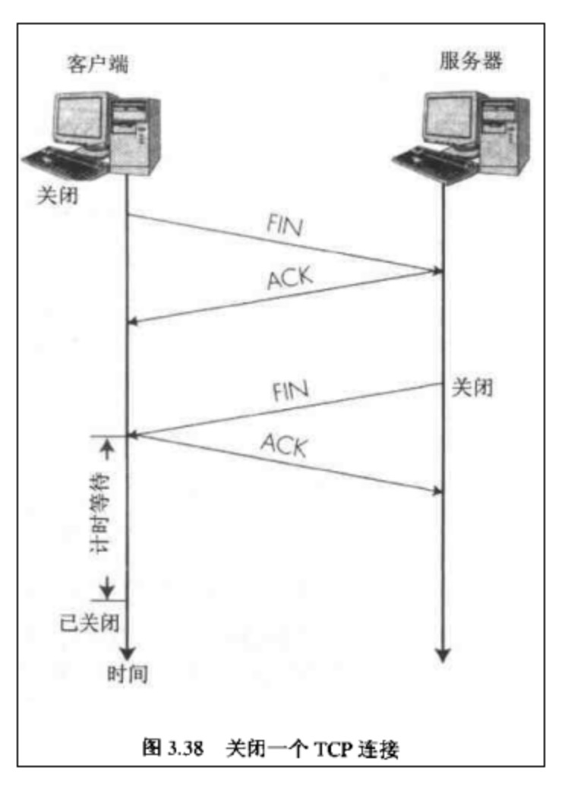
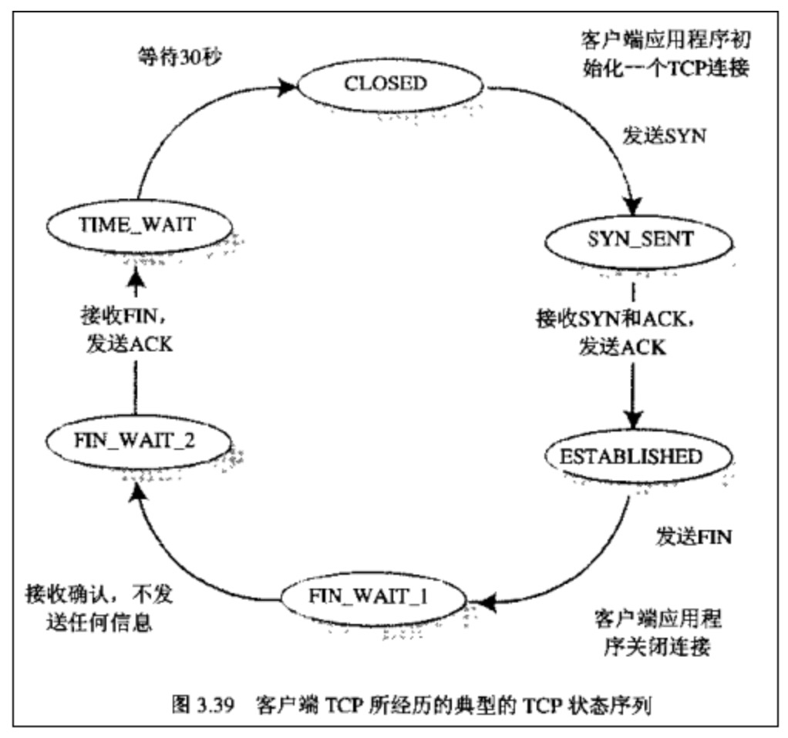
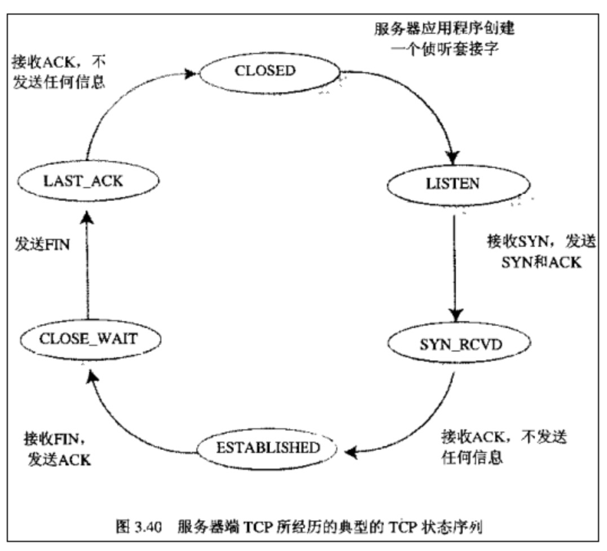
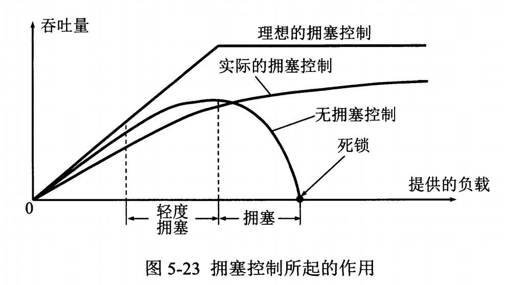
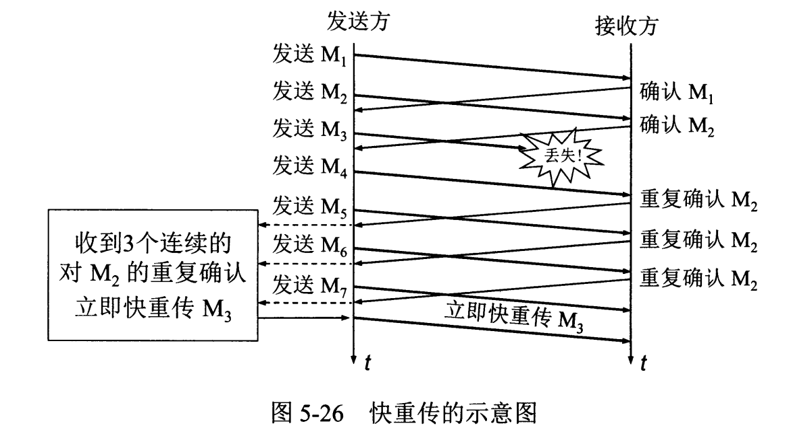

* TCP 的三次握手和四次挥手

	* 三次握手

		首先Client端发送连接请求报文，Server段接受连接后回复ACK报文，并为这次连接分配资源。Client端接收到ACK报文后也向Server段发生ACK报文，并分配资源，这样TCP连接就建立了
		
		
		
	* 四次挥手
	
		假设Client端发起中断连接请求，也就是发送FIN报文。Server端接到FIN报文后，意思是说"我Client端没有数据要发给你了"，但是如果你还有数据没有发送完成，则不必急着关闭Socket，可以继续发送数据。所以你先发送ACK，"告诉Client端，你的请求我收到了，但是我还没准备好，请继续你等我的消息"。这个时候Client端就进入FIN_WAIT状态，继续等待Server端的FIN报文。当Server端确定数据已发送完成，则向Client端发送FIN报文，"告诉Client端，好了，我这边数据发完了，准备好关闭连接了"。Client端收到FIN报文后，"就知道可以关闭连接了，但是他还是不相信网络，怕Server端不知道要关闭，所以发送ACK后进入TIME_WAIT状态，如果Server端没有收到ACK则可以重传。“，Server端收到ACK后，"就知道可以断开连接了"。Client端等待了2MSL后依然没有收到回复，则证明Server端已正常关闭，那好，我Client端也可以关闭连接了。Ok，TCP连接就这样关闭了！
		
		
		
	* 整个过程Client端所经历的状态
		
		
		
	* Server端所经历的过程如下

		
	
	* 为什么连接的时候是三次握手，关闭的时候却是四次握手

		因为当Server端收到Client端的SYN连接请求报文后，可以直接发送SYN+ACK报文。其中ACK报文是用来应答的，SYN报文是用来同步的。但是关闭连接时，当Server端收到FIN报文时，很可能并不会立即关闭SOCKET，所以只能先回复一个ACK报文，告诉Client端，"你发的FIN报文我收到了"。只有等到我Server端所有的报文都发送完了，我才能发送FIN报文，因此不能一起发送。故需要四步握手

	* 为什么TIME\_WAIT状态需要经过2MSL(最大报文段生存时间)才能返回到CLOSE状态
	
		* 确保最后一个确认报文能够到达。如果 B 没收到 A 发送来的确认报文，那么就会重新发送连接释放请求报文，A 等待一段时间就是为了处理这种情况的发生
		* 等待一段时间是为了让本连接持续时间内所产生的所有报文都从网络中消失，使得下一个新的连接不会出现旧的连接请求报文

* [TCP 11种状态](https://blog.csdn.net/pearl_c/article/details/51226320)

* 三次握手的原因

	第三次握手是为了防止失效的连接请求到达服务器，让服务器错误打开连接。

	客户端发送的连接请求如果在网络中滞留，那么就会隔很长一段时间才能收到服务器端发回的连接确认。客户端等待一个超时重传时间之后，就会重新请求连接。但是这个滞留的连接请求最后还是会到达服务器，如果不进行三次握手，那么服务器就会打开两个连接。如果有第三次握手，客户端会忽略服务器之后发送的对滞留连接请求的连接确认，不进行第三次握手，因此就不会再次打开连接
	
* 四次挥手的原因

	客户端发送了 FIN 连接释放报文之后，服务器收到了这个报文，就进入了 CLOSE-WAIT 状态。这个状态是为了让服务器端发送还未传送完毕的数据，传送完毕之后，服务器会发送 FIN 连接释放报文

* TCP 滑动窗口

	窗口是缓存的一部分，用来暂时存放字节流。发送方和接收方各有一个窗口，接收方通过 TCP 报文段中的窗口字段告诉发送方自己的窗口大小，发送方根据这个值和其它信息设置自己的窗口大小
	
	发送窗口内的字节都允许被发送，接收窗口内的字节都允许被接收。如果发送窗口左部的字节已经发送并且收到了确认，那么就将发送窗口向右滑动一定距离，直到左部第一个字节不是已发送并且已确认的状态；接收窗口的滑动类似，接收窗口左部字节已经发送确认并交付主机，就向右滑动接收窗口
	
	接收窗口只会对窗口内最后一个按序到达的字节进行确认，例如接收窗口已经收到的字节为 {31, 34, 35}，其中 {31} 按序到达，而 {34, 35} 就不是，因此只对字节 31 进行确认。发送方得到一个字节的确认之后，就知道这个字节之前的所有字节都已经被接收
	
	

* TCP 流量控制

	流量控制是为了控制发送方发送速率，保证接收方来得及接收
	
	接收方发送的确认报文中的窗口字段可以用来控制发送方窗口大小，从而影响发送方的发送速率。将窗口字段设置为 0，则发送方不能发送数据
	
* TCP 拥塞控制

	如果网络出现拥塞，分组将会丢失，此时发送方会继续重传，从而导致网络拥塞程度更高。因此当出现拥塞时，应当控制发送方的速率。这一点和流量控制很像，但是出发点不同。流量控制是为了让接收方能来得及接收，而拥塞控制是为了降低整个网络的拥塞程度
	
	
	
	TCP 主要通过四个算法来进行拥塞控制：慢开始、拥塞避免、快重传、快恢复
	
	发送方需要维护一个叫做拥塞窗口（cwnd）的状态变量，注意拥塞窗口与发送方窗口的区别：拥塞窗口只是一个状态变量，实际决定发送方能发送多少数据的是发送方窗口
	
	为了便于讨论，做如下假设：

	* 接收方有足够大的接收缓存，因此不会发生流量控制；
	* 虽然 TCP 的窗口基于字节，但是这里设窗口的大小单位为报文段

	

	1. 慢开始与拥塞避免

		发送的最初执行慢开始，令 cwnd = 1，发送方只能发送 1 个报文段；当收到确认后，将 cwnd 加倍，因此之后发送方能够发送的报文段数量为：2、4、8 ...

		注意到慢开始每个轮次都将 cwnd 加倍，这样会让 cwnd 增长速度非常快，从而使得发送方发送的速度增长速度过快，网络拥塞的可能性也就更高。设置一个慢开始门限 ssthresh，当 cwnd >= ssthresh 时，进入拥塞避免，每个轮次只将 cwnd 加 1。

		如果出现了超时，则令 ssthresh = cwnd / 2，然后重新执行慢开始
		
	2. 快重传与快恢复

		在接收方，要求每次接收到报文段都应该对最后一个已收到的有序报文段进行确认。例如已经接收到 M1 和 M2，此时收到 M4，应当发送对 M2 的确认。

		在发送方，如果收到三个重复确认，那么可以知道下一个报文段丢失，此时执行快重传，立即重传下一个报文段。例如收到三个 M2，则 M3 丢失，立即重传 M3。

		在这种情况下，只是丢失个别报文段，而不是网络拥塞。因此执行快恢复，令 ssthresh = cwnd / 2 ，cwnd = ssthresh，注意到此时直接进入拥塞避免。

		慢开始和快恢复的快慢指的是 cwnd 的设定值，而不是 cwnd 的增长速率。慢开始 cwnd 设定为 1，而快恢复 cwnd 设定为 ssthresh
		
		
	
* 在 TCP 的三次握手中，采用随机产生的初始化序列号进行请求，这样主要是为了网络安全的因素着想。如果不是随机产生初始序列号，黑客将会以很容易的方式获取到你与其他主机之间通信的初始化序列号，并且伪造序列号进行攻击，这已经成为一种很常见的网络攻击手段

* TCP 粘包

    [怎么解决TCP网络传输“粘包”问题？](https://www.zhihu.com/question/20210025)

    [什么是TCP粘包、为什么UDP不会粘包](https://zhuanlan.zhihu.com/p/41709589)

* TCP 可靠，UDP 不可靠的原因

    TCP 有发送窗口，接受窗口，有 ACK 机制，UDP 没有 ACK 机制，而且 UDP 只有接受窗口，发送端也没有流量控制，发就完事了，这样接收端会丢失数据，UDP 也可以做到可靠，需要基于 UDP 定义一个新的协议 —— RUDP
