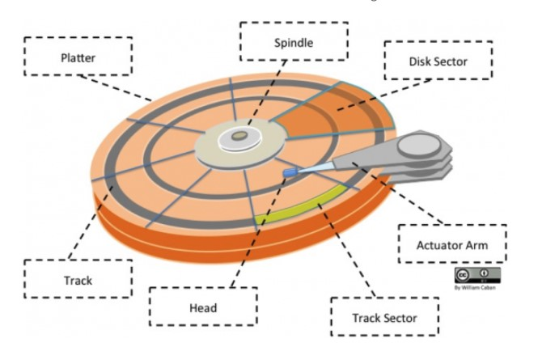

* 进程的出现是为了更好的利用 CPU 资源使得并发成为可能，进程是系统资源分配的最小单位

* 线程的出现是为了降低上下文切换的消耗，提高系统的并发性，并突破一个进程只能干一样事的缺陷，使到进程内并发成为可能，线程共享进程的大部分资源，并参与 CPU 的调度, 当然线程自己也是拥有自己的资源的，例如，栈，寄存器等等，线程是 CPU 调度的基本单位

* 协程通过在线程中实现调度，避免了陷入内核级别的上下文切换造成的性能损失，进而突破了线程在IO上的性能瓶颈，协程不是被操作系统内核所管理，而完全是由程序所控制（也就是在用户态执行）

* 并发性(concurrency)，又称共行性，是指能处理多个同时性活动的能力，并发事件之间不一定要同一时刻发生。 并行(parallelism)是指同时发生的两个并发事件，具有并发的含义，而并发则不一定并行

* 系统调用：如果一个进程在用户态需要使用内核态的功能，就进行系统调用从而陷入内核，由操作系统代为完成

	
	
* 用户空间和内核空间

	现在操作系统都是采用虚拟存储器，那么对32位操作系统而言，它的寻址空间（虚拟存储空间）为4G（2的32次方）。操作系统的核心是内核，独立于普通的应用程序，可以访问受保护的内存空间，也有访问底层硬件设备的所有权限。为了保证用户进程不能直接操作内核（kernel），保证内核的安全，操心系统将虚拟空间划分为两部分，一部分为内核空间，一部分为用户空间。针对linux操作系统而言，将最高的1G字节（从虚拟地址0xC0000000到0xFFFFFFFF），供内核使用，称为内核空间，而将较低的3G字节（从虚拟地址0x00000000到0xBFFFFFFF），供各个进程使用，称为用户空间
	
* 进程状态的切换

	
	
	* 就绪状态（ready）：等待被调度
	* 运行状态（running）
	* 阻塞状态（waiting）：等待资源

	应该注意以下内容：

	* 只有就绪态和运行态可以相互转换，其它的都是单向转换。就绪状态的进程通过调度算法从而获得 CPU 时间，转为运行状态；而运行状态的进程，在分配给它的 CPU 时间片用完之后就会转为就绪状态，等待下一次调度。
	* 阻塞状态是缺少需要的资源从而由运行状态转换而来，但是该资源不包括 CPU 时间，缺少 CPU 时间会从运行态转换为就绪态。

	* wait()
		
		> pid\_t wait(int *status)
		
		父进程调用 wait() 会一直阻塞，直到收到一个子进程退出的 SIGCHLD 信号，之后 wait() 函数会销毁子进程并返回

		如果成功，返回被收集的子进程的进程 ID；如果调用进程没有子进程，调用就会失败，此时返回 -1，同时 errno 被置为 ECHILD

		参数 status 用来保存被收集的子进程退出时的一些状态，如果对这个子进程是如何死掉的毫不在意，只想把这个子进程消灭掉，可以设置这个参数为 NULL
		
	* waitpid()

		> pid\_t waitpid(pid_t pid, int *status, int options)
		
		作用和 wait() 完全相同，但是多了两个可由用户控制的参数 pid 和 options
		
		pid 参数指示一个子进程的 ID，表示只关心这个子进程退出的 SIGCHLD 信号。如果 pid=-1 时，那么和 wait() 作用相同，都是关心所有子进程退出的 SIGCHLD 信号
		
		options 参数主要有 WNOHANG 和 WUNTRACED 两个选项，WNOHANG 可以使 waitpid() 调用变成非阻塞的，也就是说它会立即返回，父进程可以继续执行其它任务
		
	* 孤儿进程

		一个父进程退出，而它的一个或多个子进程还在运行，那么这些子进程将成为孤儿进程。

		孤儿进程将被 init 进程（进程号为 1）所收养，并由 init 进程对它们完成状态收集工作。

		由于孤儿进程会被 init 进程收养，所以孤儿进程不会对系统造成危害
		
	* 僵尸进程

		一个子进程的进程描述符在子进程退出时不会释放，只有当父进程通过 wait() 或 waitpid() 获取了子进程信息后才会释放。如果子进程退出，而父进程并没有调用 wait() 或 waitpid()，那么子进程的进程描述符仍然保存在系统中，这种进程称之为僵尸进程。

		僵尸进程通过 ps 命令显示出来的状态为 Z（zombie）。

		系统所能使用的进程号是有限的，如果产生大量僵尸进程，将因为没有可用的进程号而导致系统不能产生新的进程。

		要消灭系统中大量的僵尸进程，只需要将其父进程杀死，此时僵尸进程就会变成孤儿进程，从而被 init 所收养，这样 init 就会释放所有的僵尸进程所占有的资源，从而结束僵尸进程。
	
* 进程通信

	* 管道

		管道是通过调用 pipe 函数创建的，fd[0] 用于读，fd[1] 用于写
		
		```
		int pipe(int fd[2]);
		```
		
		它具有以下限制：
		
		* 只支持半双工
		* 只能在父子进程中使用

		
		
		优点：简单方便
		
		缺点：半双工，只能在父子进程间通信，缓冲区有限
		
	* FIFO

		也称为命名管道，去除了管道只能在父子进程中使用的限制
		
		FIFO 常用于客户-服务器应用程序中，FIFO 用作汇聚点，在客户进程和服务器进程之间传递数据
		
		
		
		优点：相比管道来说，可以在任何进程间通信
		
		缺点：半双工，长期存在于内存中，使用不当容易出错，缓冲区有限
		
	* 消息队列

		相比于 FIFO 来说，消息队列有如下的好处

		* 消息队列可以独立于读写进程存在，从而避免了 FIFO 中同步管道的打开和关闭时可能产生的困难
		* 避免了 FIFO 的同步阻塞问题，不需要进程自己提供同步方法
		* 读进程可以根据消息类型有选择地接收消息，而不像 FIFO 那样只能默认地接收

		优点：可以实现任何进程间的通信，并通过系统调用函数来实现消息发送和接收之间的同步
		
		缺点：信息的复制需要额外消耗CPU的时间，不适宜于信息量大或操作频繁的场合

	* 信号量
		
		它是一个计数器，用于为多个进程提供对共享数据对象的访问，多用于锁的实现
		
		优点：可以同步进程
		
		缺点：信号量有限
		
	* 共享存储

		允许多个进程共享一个给定的存储区。因为数据不需要在进程之间复制，所以这是最快的一种 IPC。

		需要使用**信号量**用来同步对共享存储的访问。

		多个进程可以将同一个文件映射到它们的地址空间从而实现共享内存。另外 XSI 共享内存不是使用文件，而是使用使用内存的匿名段
		
		优点：无须复制，快捷，消息量大
		
		缺点：需要使用信号量实现进程间的读写同步，不能在跨计算机的进程间通信

	* 套接字
		
		优点
	
		* 传输数据为字节级，传输数据可自定义，数据量小效率高
		* 传输数据时间短，性能高
		* 适合于客户端和服务器端之间信息实时交互
		* 可以加密,数据安全性强
		
		缺点
		
		需对传输的数据进行解析，转化成应用级的数据
	
* 死锁

	必要条件
	
	* 互斥：每个资源要么已经分配给了一个进程，要么就是可用的
	* 占有和等待：已经得到了某个资源的进程可以再请求新的资源
	* 不可抢占：已经分配给一个进程的资源不能强制性地被抢占，它只能被占有它的进程显式地释放
	* 环路等待：有两个或者两个以上的进程组成一条环路，该环路中的每个进程都在等待下一个进程所占有的资源

* 死锁检测与死锁恢复

	上图为资源分配图，其中方框表示资源，圆圈表示进程。资源指向进程表示该资源已经分配给该进程，进程指向资源表示进程请求获取该资源。

	图 a 可以抽取出环，如图 b，它满足了环路等待条件，因此会发生死锁。

	每种类型一个资源的死锁检测算法是通过检测有向图是否存在环来实现，从一个节点出发进行深度优先搜索，对访问过的节点进行标记，如果访问了已经标记的节点，就表示有向图存在环，也就是检测到死锁的发生
	
	
	
* 死锁预防

	在程序运行之前预防发生死锁

	破坏死锁发生的四个必要条件
	
* 死锁避免
	
	在程序运行时避免发生死锁
	
	银行家算法

* 虚拟内存

	虚拟内存的目的是为了让物理内存扩充成更大的逻辑内存，从而让程序获得更多的可用内存

	为了更好的管理内存，操作系统将内存抽象成地址空间。每个程序拥有自己的地址空间，这个地址空间被分割成多个块，每一块称为一页。这些页被映射到物理内存，但不需要映射到连续的物理内存，也不需要所有页都必须在物理内存中。当程序引用到不在物理内存中的页时，由硬件执行必要的映射，将缺失的部分装入物理内存并重新执行失败的指令

	从上面的描述中可以看出，虚拟内存允许程序不用将地址空间中的每一页都映射到物理内存，也就是说一个程序不需要全部调入内存就可以运行，这使得有限的内存运行大程序成为可能。例如有一台计算机可以产生 16 位地址，那么一个程序的地址空间范围是 0~64K。该计算机只有 32KB 的物理内存，虚拟内存技术允许该计算机运行一个 64K 大小的程序
	
	
	
* 页面置换算法

	在程序运行过程中，如果要访问的页面不在内存中，就发生缺页中断从而将该页调入内存中。此时如果内存已无空闲空间，系统必须从内存中调出一个页面到磁盘对换区中来腾出空间

	页面置换算法和缓存淘汰策略类似，可以将内存看成磁盘的缓存。在缓存系统中，缓存的大小有限，当有新的缓存到达时，需要淘汰一部分已经存在的缓存，这样才有空间存放新的缓存数据

	页面置换算法的主要目标是使页面置换频率最低（也可以说缺页率最低）
	
	* 最佳

	> OPT, Optimal replacement algorithm
	
	所选择的被换出的页面将是最长时间内不再被访问，通常可以保证获得最低的缺页率。

	是一种理论上的算法，因为无法知道一个页面多长时间不再被访问
	
	举例：一个系统为某进程分配了三个物理块，并有如下页面引用序列：
	
	`7032`
	
	开始运行时，先将 7, 0, 1 三个页面装入内存。当进程要访问页面 2 时，产生缺页中断，会将页面 7 换出，因为页面 7 再次被访问的时间最长
	
	* 最近最久未使用

	> LRU, Least Recently Used
	
	虽然无法知道将来要使用的页面情况，但是可以知道过去使用页面的情况。LRU 将最近最久未使用的页面换出。

	为了实现 LRU，需要在内存中维护一个所有页面的链表。当一个页面被访问时，将这个页面移到链表表头。这样就能保证链表表尾的页面是最近最久未访问的。

	因为每次访问都需要更新链表，因此这种方式实现的 LRU 代价很高
	
	`47071012126`
	
	
	
	* 最近未使用

	> NRU, Not Recently Used
	
	每个页面都有两个状态位：R 与 M，当页面被访问时设置页面的 R=1，当页面被修改时设置 M=1。其中 R 位会定时被清零。可以将页面分成以下四类：

	* R=0，M=0
	* R=0，M=1
	* R=1，M=0
	* R=1，M=1
	
	当发生缺页中断时，NRU 算法随机地从类编号最小的非空类中挑选一个页面将它换出。

	NRU 优先换出已经被修改的脏页面（R=0，M=1），而不是被频繁使用的干净页面（R=1，M=0）
	
	* 先进先出

	> FIFO, First In First Out
	
	选择换出的页面是最先进入的页面
	
	该算法会将那些经常被访问的页面也被换出，从而使缺页率升高
	
	* 第二次机会算法

	FIFO 算法可能会把经常使用的页面置换出去，为了避免这一问题，对该算法做一个简单的修改：

	当页面被访问 (读或写) 时设置该页面的 R 位为 1。需要替换的时候，检查最老页面的 R 位。如果 R 位是 0，那么这个页面既老又没有被使用，可以立刻置换掉；如果是 1，就将 R 位清 0，并把该页面放到链表的尾端，修改它的装入时间使它就像刚装入的一样，然后继续从链表的头部开始搜索
	
	
	
	* 时钟

	> clock
	
	第二次机会算法需要在链表中移动页面，降低了效率。时钟算法使用环形链表将页面连接起来，再使用一个指针指向最老的页面
	
	
	
* 磁盘结构

	* 盘面（Platter）：一个磁盘有多个盘面
	* 磁道（Track）：盘面上的圆形带状区域，一个盘面可以有多个磁道
	* 扇区（Track Sector）：磁道上的一个弧段，一个磁道可以有多个扇区，它是最小的物理储存单位，目前主要有 512 bytes 与 4 K 两种大小
	* 磁头（Head）：与盘面非常接近，能够将盘面上的磁场转换为电信号（读），或者将电信号转换为盘面的磁场（写）
	* 制动手臂（Actuator arm）：用于在磁道之间移动磁头
	* 主轴（Spindle）：使整个盘面转动

	

* 磁盘调度时间

	读写一个磁盘块的时间的影响因素有：

	* 旋转时间（主轴转动盘面，使得磁头移动到适当的扇区上）
	* 寻道时间（制动手臂移动，使得磁头移动到适当的磁道上）
	* 实际的数据传输时间

	其中，寻道时间最长，因此磁盘调度的主要目标是使磁盘的平均寻道时间最短
	
	* 先来先服务

		按照磁盘请求的顺序进行调度
		
		优点是公平和简单。缺点也很明显，因为未对寻道做任何优化，使平均寻道时间可能较长

	* 最短寻道时间优先

		优先调度与当前磁头所在磁道距离最近的磁道
		
		虽然平均寻道时间比较低，但是不够公平。如果新到达的磁道请求总是比一个在等待的磁道请求近，那么在等待的磁道请求会一直等待下去，也就是出现饥饿现象。具体来说，两端的磁道请求更容易出现饥饿现象

	* 电梯算法

		电梯总是保持一个方向运行，直到该方向没有请求为止，然后改变运行方向
		
		电梯算法（扫描算法）和电梯的运行过程类似，总是按一个方向来进行磁盘调度，直到该方向上没有未完成的磁盘请求，然后改变方向
		
		因为考虑了移动方向，因此所有的磁盘请求都会被满足，解决了 SSTF 的饥饿问题
		
* Linux 中的 select, poll 以及 epoll

	[Linux IO模式及 select、poll、epoll详解
](https://segmentfault.com/a/1190000003063859)
	
